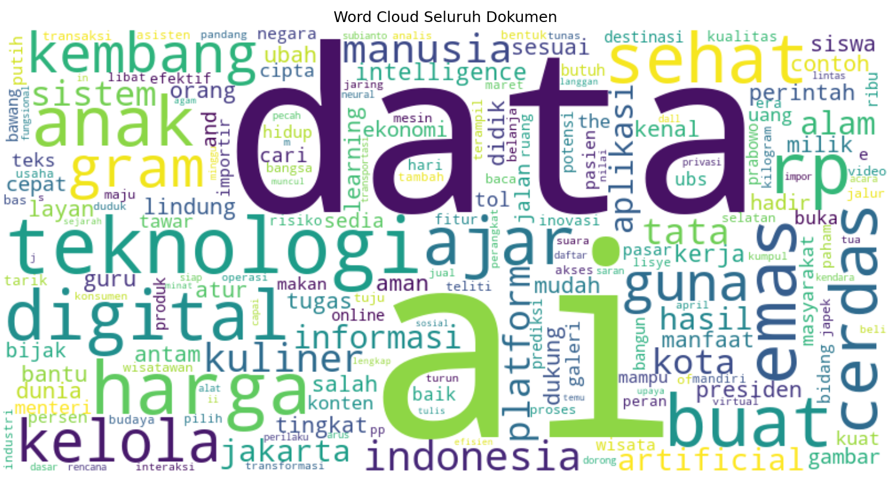
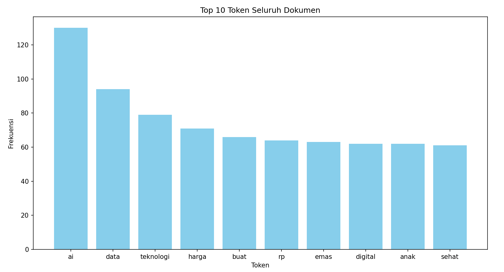
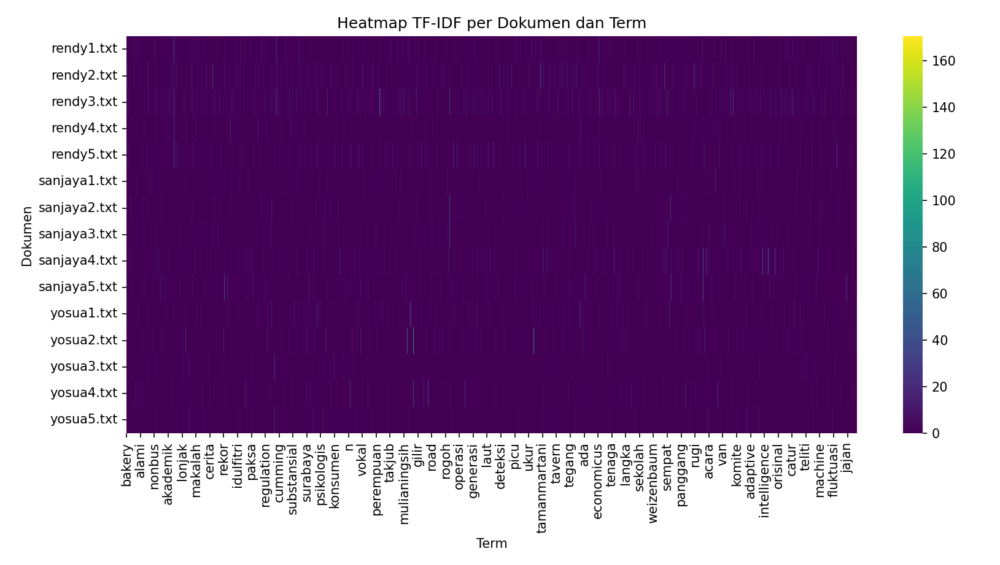
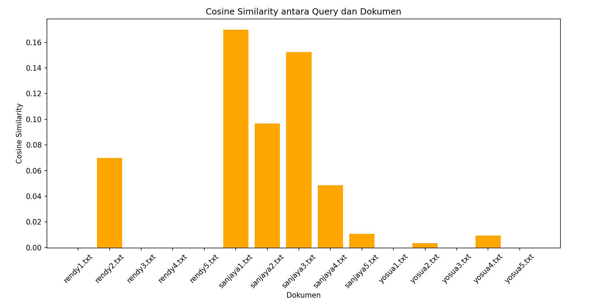

Pembobotan TF-IDF dan Query Berdasarkan Bobot
=======================================================================

I. Sumber Data
---------------
Seluruh artikel yang digunakan dalam proyek ini diperoleh dari sumber-sumber berikut:
- Artikel 1 : [rendy1.txt source](https://aws.amazon.com/id/what-is/artificial-intelligence/)
- Artikel 2 : [rendy2.txt source](https://theconversation.com/pentingnya-tata-kelola-data-kesehatan-di-era-ai-indonesia-harus-segera-bangun-layanan-kesehatan-terintegrasi-239383)
- Artikel 3 : [rendy3.txt source](https://ppg.dikdasmen.go.id/news/peranan-kecerdasan-buatan-artificial-intelligence-dalam-pendidikan)
- Artikel 4 : [rendy4.txt source](https://diskominfo.mukomukokab.go.id/artikel/teknologi-ai-bagaimana-kecerdasan-buatan-mengubah-industri-di-seluruh-dunia)
- Artikel 5 : [rendy5.txt source](https://www.djkn.kemenkeu.go.id/kanwil-jakarta/baca-artikel/16291/Artificial-Intelligence-AI-Pembantu-Pekerjaan-Manusia.html)
- Artikel 6 : [yosua1.txt source](https://www.kompasiana.com/lianafitri7184/67e87e54c925c44b563744f2/dinamika-ekonomi-perilaku-di-tengah-transformasi-digital)
- Artikel 7 : [yosua2.txt source](https://www.liputan6.com/bisnis/read/5981341/harga-emas-antam-ubs-dan-galeri24-pegadaian-jelang-lebaran-intip-daftarnya)
- Artikel 8 : [yosua3.txt source](https://money.kompas.com/read/2025/03/30/123249126/tol-japek-ii-selatan-dibuka-gratis-mulai-2-april-tapi-bus-dan-truk-dilarang)
- Artikel 9 : [yosua4.txt source](https://www.tempo.co/ekonomi/kisruh-izin-impor-bawang-putih-diprediksi-rugikan-masyarakat-rp-3-85-triliun-per-tahun-1225320)
- Artikel 10: [yosua5.txt source](https://money.kompas.com/read/2025/03/30/112000826/puncak-arus-balik-diprediksi-pada-6-maret-2025-begini-persiapan-jasa-marga)
- Artikel 11: [sanjaya1.txt source](https://itk.ac.id/rangkaian-kegiatan-dies-natalis-6-institut-teknologi-kalimantan/berita/sinergi-pemerintah-dan-pendidikan-tinggi-untuk-kemajuan-bangsa-di-istana-merdeka)
- Artikel 12: [sanjaya2.txt source](https://indonesia.go.id/kategori/sosial-budaya/9121/pemerintah-luncurkan-tunas-kebijakan-baru-lindungi-anak-di-dunia-digital?lang=1)
- Artikel 13: [sanjaya3.txt source](https://indonesia.go.id/kategori/sosial-budaya/9121/pemerintah-luncurkan-tunas-kebijakan-baru-lindungi-anak-di-dunia-digital?lang=1)
- Artikel 14: [sanjaya4.txt source](https://indonesia.go.id/kategori/sosial-budaya/9121/pemerintah-luncurkan-tunas-kebijakan-baru-lindungi-anak-di-dunia-digital?lang=1)
- Artikel 15: [sanjaya5.txt source](https://indonesia.go.id/kategori/sosial-budaya/9121/pemerintah-luncurkan-tunas-kebijakan-baru-lindungi-anak-di-dunia-digital?lang=1)

II. Langkah Pengerjaan
---------------
1. **Praproses Teks:**
   - Normalisasi teks ke huruf kecil.
   - Penghilangan karakter non-alfabet seperti angka dan tanda baca.
   - Tokenisasi menggunakan NLTK.
   - Penghapusan stopword berdasarkan daftar bahasa Indonesia.
   - Stemming dengan menggunakan Sastrawi untuk mendapatkan root dari kata.

2. **Perhitungan TF-IDF:**
   - Setiap dokumen direpresentasikan sebagai sekumpulan token beserta frekuensi kemunculannya.
   - **TF (Term Frequency):**
     Rumus:
     =\frac{\text{jumlah%20kemunculan%20}t\text{%20dalam%20}d}{\text{total%20jumlah%20kata%20dalam%20}d})

     Di mana *t* adalah token dan *d* adalah dokumen.
     
   - **IDF (Inverse Document Frequency):**  
     Rumus:
     =\log\left(\frac{N}{\text{DF}(t)}\right)) 
     Di mana *N* adalah jumlah total dokumen, dan DF(t) adalah jumlah dokumen yang mengandung token (*t*).
     
   - **TF-IDF:**  
     Rumus:
     =\text{TF}(t,d)\times%20\text{IDF}(t))

3. **Pencarian Dokumen:**
   - **Cosine Similarity:**  
     Digunakan untuk mengukur kesamaan antara vektor TF-IDF dokumen dengan vektor query.
     Rumus:  
     =\frac{v_1\cdot%20v_2}{\|v_1\|\|v_2\|})

     Yang di mana:
       - v₁ • v₂ adalah dot product dari vektor v₁ dan v₂.
       - ||v₁|| dan ||v₂|| adalah norma (magnitudo) dari masing-masing vektor.
       
4. **Visualisasi Data:**
   - **Word Cloud:** Menampilkan distribusi kata pada seluruh dokumen berdasarkan frekuensi kemunculannya.
   - **Top 10 Token:** Diagram batang yang menampilkan 10 token (kata) dengan frekuensi tertinggi dari seluruh dokumen.
   - **Heatmap TF-IDF:** Matrix visual yang menunjukkan nilai TF-IDF setiap dokumen terhadap token yang ada, yang dimana nilai yang lebih tinggi divisualisasikan dengan warna yang lebih cerah.

III. Hasil dan Visualisasi
-------------------------
Berikut adalah gambaran hasil visualisasi yang dihasilkan:

1. **Word Cloud Seluruh Dokumen:**

   Gambar ini menggambarkan distribusi kata secara keseluruhan. Kata-kata dengan frekuensi tinggi tampil lebih menonjol.
   

2. **Top 10 Token Seluruh Dokumen:**

   Diagram batang berikut menunjukkan 10 token teratas berdasarkan frekuensi kemunculannya dalam seluruh dokumen.
   

3. **Heatmap Matrix TF-IDF:**

   Heatmap ini memberikan gambaran visual mengenai nilai TF-IDF pada setiap dokumen dan token. Nilai yang lebih tinggi ditampilkan dengan warna yang lebih cerah.
   


IV. Contoh Query dan Output
---------------------------
Sebagai contoh, program dijalankan dengan query: **Presiden Indonesia**
``` Hasil pencarian berdasarkan cosine similarity
Dokumen: sanjaya1.txt, Cosine Similarity: 0.1700 
Dokumen: sanjaya3.txt, Cosine Similarity: 0.1525 
Dokumen: sanjaya2.txt, Cosine Similarity: 0.0968 
Dokumen: rendy2.txt, Cosine Similarity: 0.0697 
Dokumen: sanjaya4.txt, Cosine Similarity: 0.0486 
Dokumen: sanjaya5.txt, Cosine Similarity: 0.0106 
Dokumen: yosua4.txt, Cosine Similarity: 0.0092 
Dokumen: yosua2.txt, Cosine Similarity: 0.0034 
Dokumen: rendy1.txt, Cosine Similarity: 0.0000 
Dokumen: rendy3.txt, Cosine Similarity: 0.0000 
Dokumen: rendy4.txt, Cosine Similarity: 0.0000 
Dokumen: rendy5.txt, Cosine Similarity: 0.0000 
Dokumen: yosua1.txt, Cosine Similarity: 0.0000 
Dokumen: yosua3.txt, Cosine Similarity: 0.0000 
Dokumen: yosua5.txt, Cosine Similarity: 0.0000
```


- **Gambar Hasil Query (Cosine Similarity):**  
  

V. Catatan
----------------------
- **Proses Praproses:** Seluruh dokumen diproses menggunakan kombinasi NLTK dan Sastrawi dengan tujuan untuk memastikan token yang dihasilkan relevan.
- **Optimasi:** Untuk menghindari prosessing ulang saat query, hasil pemrosesan dokumen dan perhitungan TF-IDF disimpan menggunakan pickle, sehingga tidak perlu dihitung ulang pada eksekusi berikutnya.

